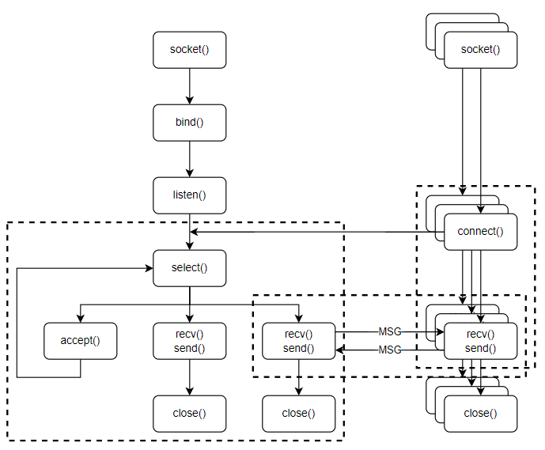

# 구성도


### IO 멀티플렉싱 기반 서버
### 정의
한 개의 프로세스, 메인 스레드가 다수의 클라이언트 요청을 처리하는 방식
### select()


여러 파일 디스크립터를 배열에 모아놓고, 이를 관찰하여 서버 및 클라이언트 소켓들의 변경 사항을 관찰
### 구현 기능
+ 한 서버에서 다수의 클라이언트 요청을 처리
+ 서버 및 클라이언트 중 한쪽이 종료될 경우, 반대편이 재실행될 때까지 대기 후 accept 혹은 connect
+ 클라이언트에서 구조체 데이터를 요청하면 서버에선 이를 전송
## 빌드 및 실행
**빌드**
```
g++ -o clnt client.cpp -pthread
g++ -o serv server.cpp
```
**서버 실행**
```
./server <서버의 IP 주소>
```
**클라이언트**
```
./clnt <서버의 IP 주소>
```
**예시**

PC A에서
```
./serv 192.168.100.124
```

PC B, C, D에서
```
./clnt 192.168.100.124
```