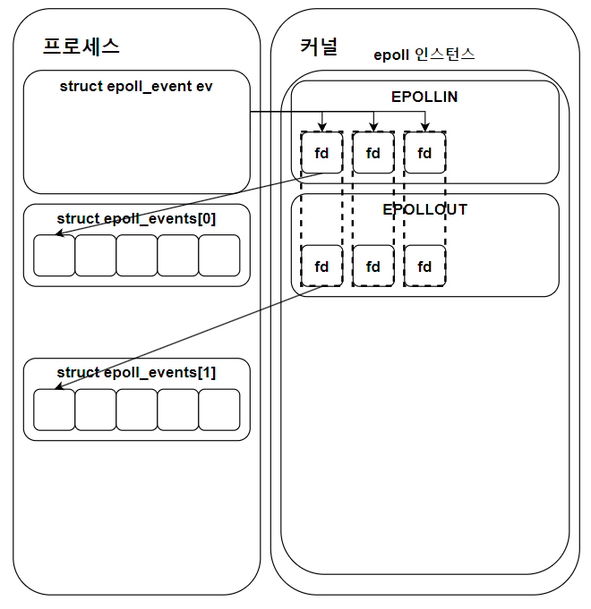

# 구성도


### IO 멀티플렉싱 기반 서버
### 정의
한 개의 프로세스, 메인 스레드가 다수의 클라이언트 요청을 처리하는 방식
### epoll()

+ 커널에서 파일 디스크립터를 관리.
+ 사건별로 나눠서 저장.
+ 변화가 감지된 FD의 목록을 반환받음.

### select()와 비교
+ select
1. 검사 가능 FD 1024로 제한
2. 관찰 영역 모든 FD 순회
3. FD_SET을 OS에 계속 전달
+ epoll
1. 커널에서 FD를 직접 관찰
2. 커널에서의 관찰 결과를 리스트(배열)로 전달
3. 리눅스에서만 사용 가능
### 구현 기능
+ 한 서버에서 다수의 클라이언트 요청을 처리
+ 서버 및 클라이언트 중 한쪽이 종료될 경우, 반대편이 재실행될 때까지 대기 후 accept 혹은 connect
+ 클라이언트에서 구조체 데이터를 요청하면 서버에선 이를 전송
## 빌드 및 실행
**빌드**
```
g++ -o clnt client.cpp -pthread
g++ -o serv server.cpp
```
**서버 실행**
```
./server <서버의 IP 주소>
```
**클라이언트**
```
./clnt <서버의 IP 주소>
```
**예시**

PC A에서
```
./serv 192.168.100.124
```

PC B, C, D에서
```
./clnt 192.168.100.124
```